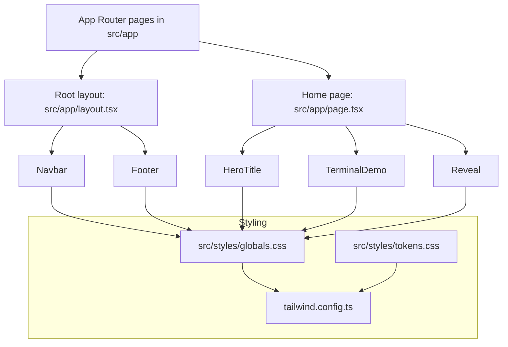

# Toolipie Website

A minimal Next.js 15 (App Router, TypeScript) site set up for static export to GitHub Pages with Tailwind CSS powered by design tokens and light/dark via `data-theme`. Uses React 19.

## Tech
- Next.js 15 App Router (TypeScript), React 19
- Tailwind CSS with CSS variable tokens (`src/styles/tokens.css`)
- Light/dark via `data-theme` attribute with persisted override and subtle crossfade
- Static export (`output: 'export'`), unoptimized images, custom domain `toolipie.com` via `public/CNAME`
- ESLint (Next defaults), Dependabot, GitHub Actions deploy to Pages

## Requirements
- Node 20 (see `.nvmrc` and `"engines"` in `package.json`)

## Getting Started
```bash
# Use Node 20
nvm use

# Install deps
npm install

# Dev server
npm run dev

# Lint / Typecheck
npm run lint
npm run typecheck

# Production build (static export)
npm run build
# Output is written to ./out because next.config.mjs has output: 'export'
```

Note: With `output: 'export'`, `npm run build` writes static assets to `out/`.

## Deploy (GitHub Pages)
- Pushing to `main` triggers `.github/workflows/gh-pages.yml` which:
  - Installs deps, lints, typechecks, builds, and uploads `./out` as the Pages artifact
- In GitHub repo settings: Settings → Pages → set Source to “GitHub Actions”
- Custom domain is configured via `public/CNAME` → `toolipie.com`

## Project Structure
```
src/
  app/            # App Router
  components/     # Shared components (Navbar, Footer, ThemeToggle)
  features/       # Feature modules
  lib/            # Utilities (client-side)
  server/         # Server-only code (if added later)
  hooks/          # React hooks
  types/          # TypeScript types
  styles/         # Tailwind + tokens
```

## Architecture



## Contributing

Contributions are welcome.

1. Fork and create a feature branch from `main`.
2. Install and run locally:
   - `nvm use`
   - `npm install`
   - `npm run dev`
3. Ensure quality:
   - `npm run lint`
   - `npm run typecheck`
   - `npm run build` (verifies static export)
4. Open a PR describing the change.

## Notes
- Images are unoptimized for static export compatibility
